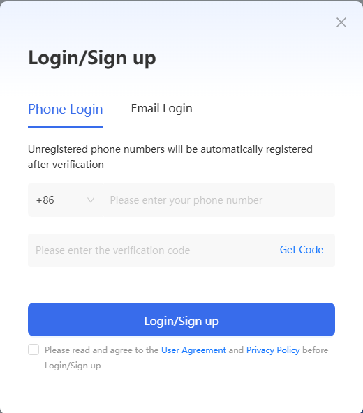

# Sign up and sign in

For first time use KernelGen, perform the following steps:

1. Open <https://KernelGen.flagos.io/login> in your browser.
2. Click **Workspace**.

   

3. Choose to signup through phone number or Email address:

    {style=lower-alpha}
    1. In the **Login/Sign up** dialogue, click **Phone Login** or **Email login**.

        

    2. Read and select the checkbox at the bottom to accept the **User Agreement** and **Privacy Policy**.
    3. Enter your phone number or Email address, and then click **Get Code**.
    4. Once you receive your verification code through text message or Email, copy and paste the verification code below your phone number or Email address, and click **Login/Sign up**.
    5. Enter your name, organization, Email address or phone number, and purpose and click **Submit**.

        

    The welcome page opens.
