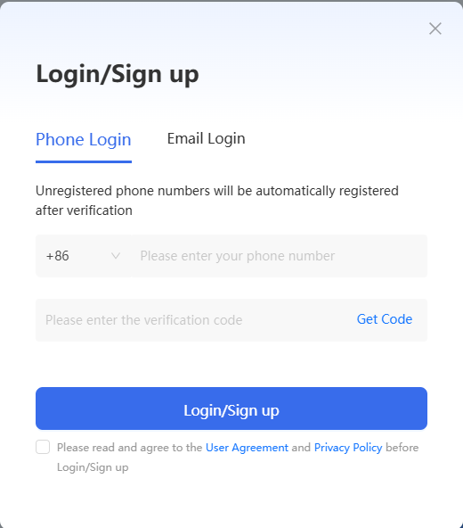

<!--
 Copyright 2026 FlagOS Contributors

 Licensed under the Apache License, Version 2.0 (the "License");
 you may not use this file except in compliance with the License.
 You may obtain a copy of the License at

     http://www.apache.org/licenses/LICENSE-2.0

 Unless required by applicable law or agreed to in writing, software
 distributed under the License is distributed on an "AS IS" BASIS,
 WITHOUT WARRANTIES OR CONDITIONS OF ANY KIND, either express or implied.
 See the License for the specific language governing permissions and
 limitations under the License.
 -->

# Sign up and sign in

For first-time users of KernelGen, perform the following steps:

1. Open <https://KernelGen.flagos.io/login> in your browser.
2. Click **Start Building for Free**.
   
3. When the page is scrolled down to the bottom, click **Web Platform**.
   
4. Choose to signup through phone number or Email address:

    {style=lower-alpha}
    1. In the **Login/Sign up** dialogue, click **Phone Login** or **Email login**.

        

    2. Read and select the checkbox at the bottom to accept the **User Agreement** and **Privacy Policy**.
    3. Enter your phone number or Email address, and then click **Get Code**.
    4. Once you receive your verification code through text message or Email, copy and paste the verification code below your phone number or Email address, and click **Login/Sign up**.
    5. Enter your name, organization, Email address or phone number, and purpose and click **Submit**.

        

    The welcome page opens.
