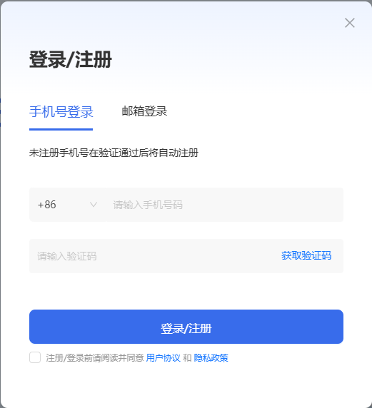

<!--
 Copyright 2026 FlagOS Contributors

 Licensed under the Apache License, Version 2.0 (the "License");
 you may not use this file except in compliance with the License.
 You may obtain a copy of the License at

     http://www.apache.org/licenses/LICENSE-2.0

 Unless required by applicable law or agreed to in writing, software
 distributed under the License is distributed on an "AS IS" BASIS,
 WITHOUT WARRANTIES OR CONDITIONS OF ANY KIND, either express or implied.
 See the License for the specific language governing permissions and
 limitations under the License.
 -->

# 注册与登录

首次使用 KernelGen 的用户，请执行以下步骤：

1. 在浏览器中打开 <https://KernelGen.flagos.io/login>。
2. 点击**免费开始构建**。
   
3. 向下滚动页面至底部，点击 **Web 平台**。
   
4. 选择通过手机号或电子邮件地址注册：

    {style=lower-alpha}
    1. 在**登录/注册**对话框中，点击**手机号登录**或**邮箱登录**。

        

    2. 阅读并勾选底部的复选框，以接受**用户协议**和**隐私政策**。
    3. 输入您的手机号或电子邮件地址，然后点击**获取验证码**。
    4. 通过短信或电子邮件收到验证码后，将验证码复制并粘贴到手机号或邮箱地址下方的输入框中，然后点击**登录/注册**。
    5. 输入您的姓名、所属机构、电子邮件地址或手机号及使用目的，然后点击**提交**。

        

    欢迎页面随即打开。
